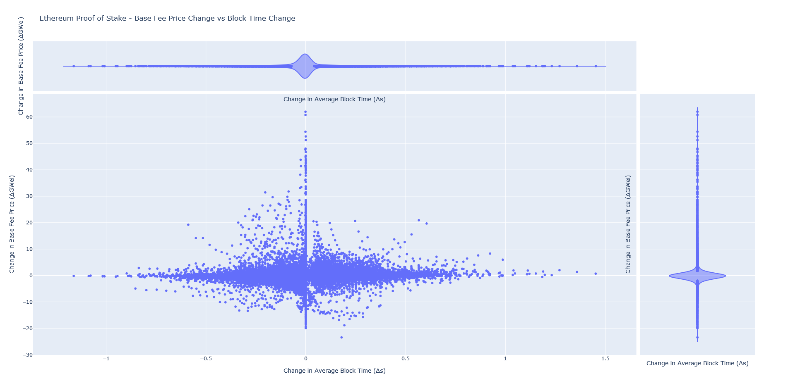

# A Tale of Two Tails: How the Merge Lowered Ethereum Gas Prices

**TL;DR:** The transition from Proof of Work to Proof of Stake has come hand in hand with a noticeable drop in gas prices.
We study the probability distributions of block production under Proof of Work and Proof of Stake and analyze their 
effect on gas fees. We conclude that the high variability in blocktimes under Proof of Work had an effect on gas prices
due to EIP-1559 mechanism. This effect is gone under Proof of Stake when blocks come at a consistent cadence.

## The Merge and Ethereum Gas Prices

The long-awaited transition of Ethereum from Proof of Work to Proof of Stake was supposed to bring multiple benefits; 
around 99.95 % lower energy consumption, a 90% drop in issuance, and laid-up the pillars for future Ethereum scalability
via sharding. But what most people agreed, myself included, is that a noticeable drop in fees was not on the table.

The oft-repeated argument was that the merge had a relatively insignificant impact on available blockspace and as fees 
are basically set by demand and supply of blockspace we shouldn't expect any significant change in fees. 
Indeed, among the changes introduced by the merge was a slightly faster rate of block production going from a rough 
average of 14 seconds per block to 12 seconds. That's an increase in supply of blockspace of 16%, not negligible but certainly 
not earth-shattering.

Yet, after the merge, the average price of the base fee has dropped from 15 GWei in the last weeks under Proof of Work 
to 9 GWei in the weeks immediately after the merge. That's a 35% drop. More significant even is drop in the median fees, 
which is far more representative to the average user. The following table summarizes the price difference measured 
during the last 10 days of PoW and the first 10 days of PoS.

|       | PoW Base Fee (GWei) | PoS Base Fee (GWei) |
|:------|---------------:|---------------:|
| mean  |       14.5779  |        9.0571  |
| std   |       10.9095  |        8.24051 |
| min   |        2.06062 |        1.70652 |
| 25%   |        7.26827 |        4.43512 |
| 50%   |       11.1879  |        6.5786  |
| 75%   |       18.4682  |       10.6774  |
| max   |      159.188   |      112.434   |

Some have speculated that the bear market has resulted in lower activity on the network and this is just a reflection
of it. But this is unlikely to be the sole explanation; the difference is significant, the change was sharp and noticeable,
and the timeframe in which it has occurred relatively small.

Most importantly, the data doesn't support this view. Right after the merge, demand for blockspace as measured by daily
gas used went up by 16% as expected by the faster block production. Demand for blockspace essentially saturated immediately
the increase in available blockspace.

Pending transactions, a measure of how long is the queue to place a transaction on the network, also seemed to not have 
been impacted. 

There is the same appetite for Ethereum blockspace in the weeks right after the merge as there was before 
it. Dying demand doesn't seem to be the culprit. 

## Block Production under Proof of Work

A few days after the merge I especulated in a post in [/r/ethfinance](https://np.reddit.com/r/ethfinance/comments/xh7km4/daily_general_discussion_september_18_2022/ioz8rau/)
that a possible reason behind the drop in fees was a subtle change introduced by the merge. Under Proof of Stake every 
12 seconds a random validator of the network has the responsiblity of producing a block. Every 12 seconds, like a swiss clock.
But a Proof of Work blockchain doesn't have the luxury of producing blocks so regularly. Instead, it relies on solving a 
cryptographic puzzle whose difficulty is dynamically
adjusted to average out certain cadence of block production. In the days before the merge, Ethereum was roughly averaging
14 seconds per block. The process of solving the cryptographic puzzle to create the next block is a Poisson process and
follows (for fixed difficulty) the aptly named Poisson probability distribution. Here is the empirical probability distribution measured during
the last 10 days of PoW.

You may notice that under Proof of Work most blocks occur relatively faster than 14 seconds. In fact, 
the median time between blocks is significantly shorter, closer to 10 seconds. That is, half of the blocks are produced 
under 10 seconds. But some blocks are produced much faster and many others much much slower. Here is a table summarizing 
the statistics:

|       |   Block Time (s) |
|:------|----------------:|
| mean  |         14.1516 |
| std   |         13.687  |
| min   |          1      |
| 5%    |          1      |
| 25%   |          5      |
| 50%   |         10      |
| 75%   |         19      |
| 95%   |         42      |
| max   |        175      |

5% of blocks were produced with a block time of over 42 seconds. That's 1 in 20 blocks that comes incredibly delayed. And there
was even an instance of a block being produced with a delay of 175 seconds!

With these numbers the idea that an irregular block production maybe was having an impact on gas fees becomes more palatable.
The basic idea is  that demand for blockspace is an external factor and not in control of the network, transactions arrive every
second from users and are placed into the queue. When a block is produced, transactions can get picked up from the queue 
and included in the block. If a block arrives significantly delayed, it's likely to encounter significantly larger number 
of transactions pending. 

A key-piece in all of this is EIP-1559, it's most known for burning ETH. But it does two
very important things apart from burning the base fee paid; it sets the price of gas dynamically, and it can enlarge or shrink
blocks (up to a maximum of twice the intended average block size). With this mechanism the network becomes adaptable to the ebb
and flow of market demand. If there is too many pending transactions, the network enlarges blocks allowing to include more transactions.
But also raises the price of gas, to compensate. On average and over long-terms it will target certain block size, so if 
there is too much demand, price of gas keeps increasing until it becomes so expensive that demand fizzles down
and blocks contract again.

The hypothesis is that block delays result in pent-up demand for blockspace which result in EIP-1559 targeting enlarged
blocks but also raising the price of gas. A block that arrives at 28 seconds is effectively equivalent to a missed block, 
so it's more likely to saturate the maximum blocksize allowed by EIP-1559. Imagine what happens when 5% of blocks arrive after
42 seconds, and you have the occasional 175 second delay. The other side of the coin is that we also have some blocks
arriving much faster, these should result in a lowering of gas prices as they are less likely to be filled. Unfortunately
gas prices are bounded from below (can't go lower than 0) but they are not from above, so block delays can skew gas prices 
upwards significantly. In fact, the underlying distribution that generates blocks is itself
significantly skewed, so it's perhaps reasonable to assume a similar effect on gas prices.
One could also argue that when blocks arrive too soon the network is operating less efficiently. As they become less likely
to be able to be filled to their intended capacity. In much the same way a metro line works better if its trains
arrive at a consistent cadence than if a few trains arrive in quick succession followed by long gaps right after.

It must be said that the primary driver for gas prices is exogenous to the network, in essence it's demand for blockspace 
by its users. This is first and foremost what causes gas prices to fluctuate. If a lot of network activity happens in a 
given moment of time gas prices go up. If it dries down, they go down. This is the primary driver and we are not 
trying to argue against it. But the variability in blocktimes could have been making things worse at random times when, 
due to pure random chance, a few consecutive blocks arrive delayed.

## Block Production under Proof of Stake

Block production under Proof of Stake is, from a statistical point of view, simple and boring. A random validator is asked 
to produce a block every 12 seconds. If the validator is online and operational it will produce a block. If not, the network
will have a missed block and will skip a beat. Someone else will be asked to produce a block 12 seconds later. This means
that the network has a constant cadence of block production every 12 seconds with the occasional block miss caused by the percentage of 
validators not operational. The block time histogram looks as follows:

Close to 99% of the blocks during the first 10 days were produced in exactly 12 seconds, the other 1% amount for 1 miss
2 consecutive misses. That's a very consistent block production rate. We should expect the effect described above to be
negligible in PoS when the network operates at such a high rate of participation as we have observed.

## Measuring the Impact of Delayed Blocks in Gas Fees

We have a simple target in mind; measure the relation, if any, a change in blocktimes over certain period
of time has with changes in gas prices. We should expect a positive correlation between the change in block times and the
change in gas prices.

To calculate the change in block times we can take a simple moving moving average of blocktimes (i.e. the average blocktime
over the last n periods) and calculate its rate of change. The rate of change can be estimated by a difference between
the data itself and a longer term exponential moving average. The longer term exponential moving average reacts slower to changes,
so if average blocktime is trending up the difference will become positive, if blocktimes are trending down it will become 
negative.

A similar protocol can be used for gas fees.

### Proof of Work

If we do so and plot the change in gas fees vs change in blocktimes we obtain the following for Ethereum operating under Proof
of Work:

We can immediately see a noticeable upward tilt in that blob of points. When blocktimes increase so does the change in gas fees.
When block times decrease so do gas fees. The data is obviously noisy, blocktimes vary widely under Proof of Work (left-right) axis
and as we have argued the main driver of fee changes is demand which is uncorrelated to blocktimes 
but there is nevertheless a noticeable effect caused by increases or decreases in blocktimes.

We can calculate the correlation between these two variables using Spearman correlation (Spearman correlation is chosen
because we cannot assume a linear relation between blocktime growth and gas fees growth):

|                     |   blockTimeGrowth |   baseFeePerGasGrowth |
|:--------------------|------------------:|----------------------:|
| blockTimeGrowth     |          1        |              0.561703 |
| baseFeePerGasGrowth |          0.561703 |              1        |

Which confirms the positive and moderately significant correlation we saw by visual inspection.

### Proof of Stake

How does the above look for Ethereum operating under Proof of Stake?

The correlation seems gone! And we can confirm it by calculating the Spearman correlation:

|                     |   blockTimeGrowth |   baseFeePerGasGrowth |
|:--------------------|------------------:|----------------------:|
| blockTimeGrowth     |         1         |             0.0834509 |
| baseFeePerGasGrowth |         0.0834509 |             1         |

To be noticed that the scale of the X axis is significantly changed with respect to the equivalent PoW image. 
The variability in blocktime changes has diminished by almost a factor of 10.

We could speculate that the effect is still there but very muted due to almost non-existent variability
in blocktimes. If the network participation fell significantly and resulted in higher variability in blocktimes
we could see the correlation pick-up.

## Conclusion

Despite the generally held believe that The Merge wouldn't have an impact on gas fees, the contrary has been seen 
empirically. We have shown that the inconsistent block production under Proof of Work and the long-tail of its
probability distribution coupled with the EIP-1559 gas price update mechanism was resulting in users overpaying for gas.
With the transition to Proof of Stake block production became very consistent which almost completely eliminates the effect. 

The Merge has allowed Ethereum to provide a better service for its users, more predictable and consistent cadence of 
blocks while lowering fees.

The title of this piece refers to the difference in the two probability distributions and their effects on gas prices.

## Code

All the code used to extract the data, analyze it, and produce the plots can be found in the following repository: https://github.com/pa7x1/ethereum-merge-gas